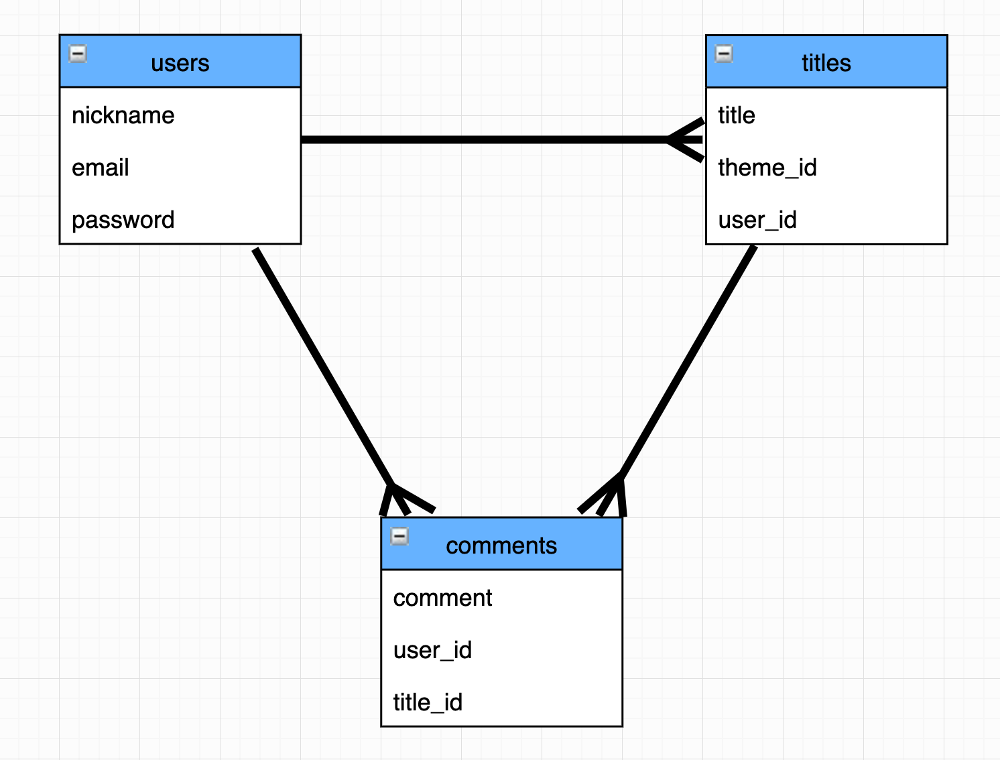

<h1 align="center">
Philopp
</h1>

## 概要

哲学系チャットコミュニティサイト

## URL
https://philopp.herokuapp.com

## テスト用アカウント

|               |                |
| ------------- | -------------- |
| nickname      | 哲学者          |
| mail          | philosophy@com |
| password      | ppphhh111      |

## 利用方法

_**自由**_、_**仕事**_、_**お金**_、_**幸せ**_、_**人間**_ 
_**運**_、_**死**_、_**病気**_、_**感情**_、_**成功**_ 
_**愛**_、_**人生**_、_**命**_、_**価値観**_、_**希望**_ 
- 用意された15のテーマについて、自由にお題を作り、自由に哲学してください。
- 投稿するにはユーザー登録を行い、ログインする必要があります。

## 目指した課題解決

例えば一匹狼で生きてきたような強い人、または迷える子羊のように弱さをさらけ出せる人、もしくは普通の人。 
どんな人にだって自身の生き方や考え方に疑問を投げかけ、哲学する一瞬がある? 
そんな一瞬で消えうる貴重な哲学を、アウトプットし、共有する。 
そうすることで、別の世界への入り口へと誘われる、かもしれない。 
それは、狼が羊になる、または羊が狼になろうとするかの如く、そんなきっかけを作りたい。 

## 洗い出した要件

- 哲学の匂いの強いトップページ
- チャットタイトル作成機能
- コメント投稿機能
- ユーザー管理機能
- SNSアカウントログイン機能
- パンくずリスト機能

## 実装した機能についてのGIFと説明

　### トップページは、「もし、ITと、哲学が、掛け合わさるとどうなるのか」というイメージを印象付けています。
 

## データベース設計

## ローカルリポジトリへのコピー方法

terminalでcloneしたいディレクトリに移動し以下コマンドを実行してください。  
git clone git@github.com:dmihi-t/philopp.git

### 環境構築
Homebrew 2.5.2  
rbenv 1.1.2  
ruby 2.6.5p114 (2019-10-01 revision 67812)  
Rails 6.0.3.3  
